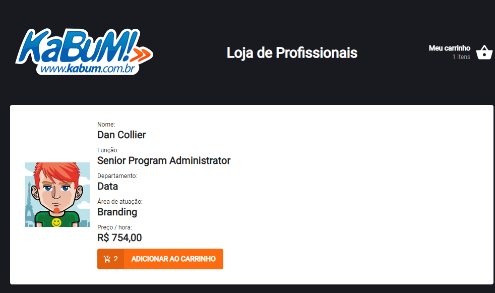
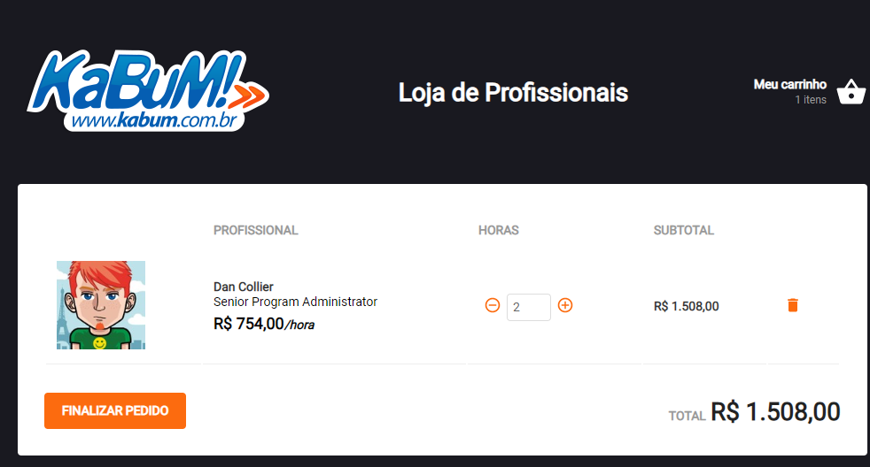
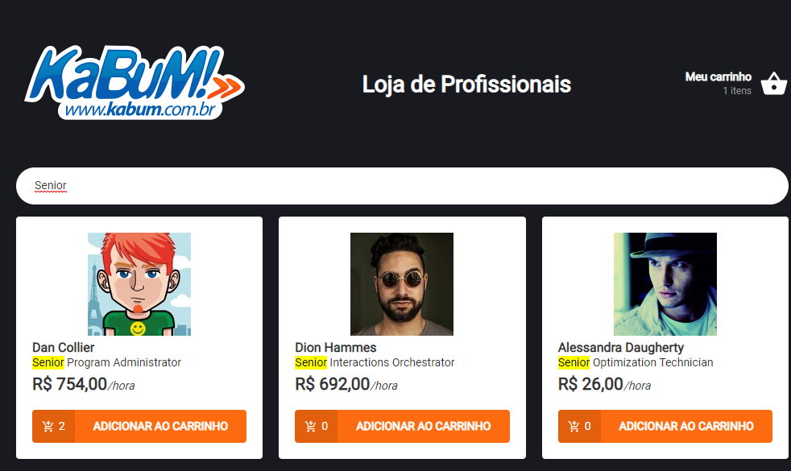

# Desafio Kabum (Dev - front-end)

## Lista de Tarefas

- O sistema deverá ser em React com redux.
- Deverá conter uma rota de listagem e descrição de produtos
- O layout deverá ser criado pelo desenvolvedor.
- Os dados devem vir de um MOCK API.
- Deverá existir a possibilidade de adicionar o produto no carrinho.
- Acrescentar e diminuir a quantidade.
- Remover do carrinho.
- Deverá ser possível acessar o carrinho com os produtos em qualquer tela do sistema.
- Na listagem, deverá ser possível filtrar pelo nome dos produtos ou id.
- Utilizar alguma metodologia css ou JSS ou Styled Component.
- Disponibilizar o codigo em um repositorio do github.

## Executando o código

- Clone o repositório em qualquer local
- Acesse a pasta e rode `yarn` ou `npm install` para baixar as dependências
- Depois rode `yarn start` ou `npm run start` para iniciar o servidor de desenvolvimento
- Seu navegador deve abrir automaticamente na página: http://localhost:3333.

## Especificações do projeto

O sistema consiste em uma "loja" virtual onde é possível comprar as horas de trabalho de profissionais cadastrados
Existe um sistema de 'estoque' que ao atingir o limite (quantidade) escolhida não é possível aumentar!

## Ferramentas e Dependências

- ReactJs como base do projeto
- Api mockada no mockapi.io (http(s)://5e0f365e9576aa0014666493.mockapi.io/) usando Axios para acesso
- Redux + Saga + Persistor para persistencia dos dados
- React Icons + Polished + Styled Components + Toastify para estilização

## Demonstração

## Telas do sistema

- Tela inicial e Listagem
  
- Tela do Produto / Profissional
  
- Tela do Carrinho
  
- Funcionamento do filtro
  
